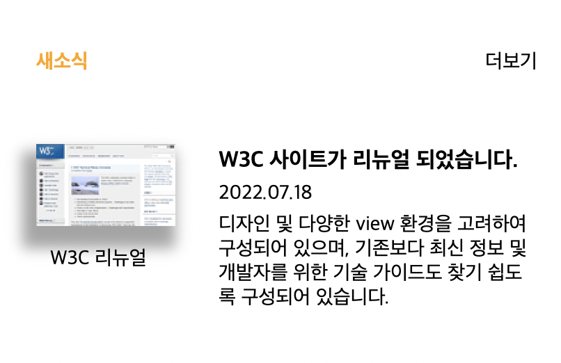

#mission-04

<h1>Grid system</h1>

Q 고려 사항

그리드 시스템을 활용한 섹션

<h2>MarkUp constructure</h2>

section>(div>h5+a)>(div>dl>(dt+dd*2))>(div>(figure>img+figcaption))

- 전체박스 - section  
- 상단 박스 - div
  - 제목 - h5 
  - 더보기 링크 이동 - a  
- 기사 박스 - div 
  - 기사 박스 - dl
  - 소제목 - dt
  - 날짜 - dd
  - 기사내용 - dd
- 사진 박스 - div
  - 이지미/설명 상자 - figure
  - 이미지 - img
  - 이미지 설명 - figcaption

<h2>CSS style sheet</h2>

전체 박스 div.container에 
<em>display: grid;</em>로 그리드 박스 지정 

.container 그리드

grid-template-rows: repeat(3, 1fr);
grid-template-columns: repeat(3, 1fr);
grid-gap: 3px;  
 
.fig / .descript / .title 
 
<em>행열 시작과 끝을 지정해 위치 배치</em>
 
grid-area: grid-row-start / grid-column-start/ grid-row-end/ grid-column-end; 
 
 

<h2>What I learned</h2>

"그리드 시스템을 이용한 요소 배치 방법"

