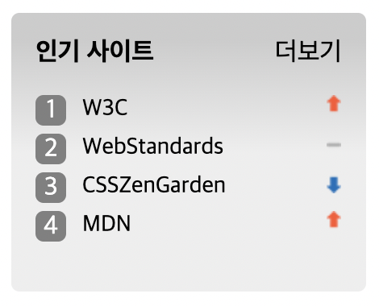

#mission - 05

<h1>스프라이트/그리드/가상요소선택자</h1>

Q 고려 사항
스프라이트를 이용한 이미지 파일 위치 지정
가상요소 선택자를 이용한 리스트 스타일 변경

<h2>MarkUp constructure</h2>

div>(h2>span)+a+ol>(li>(a>span)+span)*4

- 전체박스 div
  - 박스 제목 h2
    - 제목 부분 박스 span
  - 더보기 a
  - 랭킹 ol
    - 1~4등 li
      - 선택 a
        -  aria-label= 순위
      - 순위 상승 스프라이트 이미지 span

<h2>CSS style sheet</h2>

전체 박스 div.rank에 display: grid;로 그리드 박스 지정

- 제일 처음 행 30px 나머지 100% 
grid-template-rows: 30px 1fr;

- 각각 위치 지정  
grid-template-areas:
    "favoriteSite favoriteMore favoriteMore"
    "rank-top rank-top rank-top"
    "rank-top rank-top rank-top";
- .ranker li 숫자 그대로 적용  counter-increment: number;
- .ranker::before li 전에 가상요소선택자로 스타일 생성   content: counter(number); <em>li에서 내려받은 숫자 그대로 사용</em>
- .sprit 스프라이트 이미지 사용을 위한 기본 사이즈 지정 및 이미지 적용   background-position: 0 0; 순위별 이미지 위치 각각 지정

<h2>What I learned</h2>

' sprite 사용 방법과 가상요소 선택자 활용 방법 '

